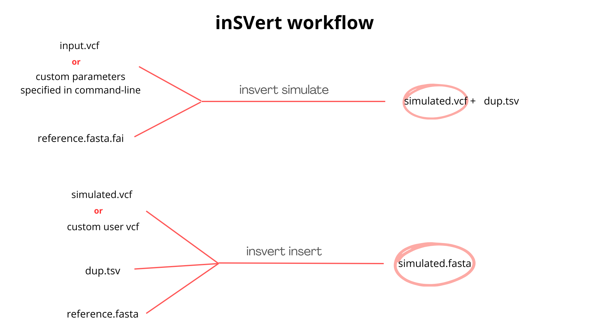

# demo specififcations 


### command-line interface design
```
inSVert <command> [options]

Commands:
    simulate    -analyze input VCF and produce a realistic fake
    insert      -inserts the SVs into the reference genome
    pipeline    -combines the above in a single process
```




## simulate

input: 
- fasta reference 
- vcf file 
or 
- user defined parameters to generate SVs (--manual option)

output:
- simulated.vcf 
- dup.tsv file 

1. given an input VCF file, it parses it and extract all the relevant data regarding the lengths and eventual copy-numbers of the SVs contained in the VCF. Using the --manual option, it is the user that specifies this information in the command line or in a config.txt file (still have to decide) as well as the parameters of the lognormal.
2. a lognormal distribution is built using that data, one for each sv-type, using the scipy.stats library.
3. an X amount of SVs is sampled from that distribution and stored into an accessible data structure.
4. the fasta.fai index file is read and all the information regarding the chromosomes and their relative lengths is collected
5. a chromsome is randomly selected (taking into account the relative lengths of each) and a random position is selected along that chromosome
6. an instance of a StructuralVariant object is built using a length collected in step 3) and the chromosome and position collected at step 5)
7. all the relevant information is registered into a bed file, which is used to keep track of where all the SVs are. 
8. the StructuralVariant objects can be formatted into a line of a VCF file, essentially a SV entry and the VCF file is built incrementally. 


## insert
given an input fasta file, from which the VCF file is based on (this can be checked from the source line of the VCF header), the SV in the VCF are programmatically placed in a copy of the fasta reference. The SVs are placed in sorted order, to avoid indexing conflicts, moreover an index for each chromosome/contig is kept to place correctly the next SVs. 

bottlenecks:
- the whole reference genome has to be loaded into memory, sucking up a huge amount of RAM
- non tandem DUPs are hard to deal with, they are scattered across the genome and need to be processed as last.

------
------

### practical considerations

due to limited computing power, the organism of choice will be yeast.


checked validity of the VCF file with vcftools (vcf-validator)

 

---

# TO DO
- check how to handle coordinates when building a VFC also thinking about the later step of FASTA modification
- implement DUP:TANDEM

BUILD INSERT MODULE
- load entire fasta into memory as a dict 
- sort VCF
- build a BED or TSV file with all the relevant information (chr, pos, end, length, sequence (INS;DUP), dup-number, copies-regions (DUP))
- process SV sequentially by chr, pos
- each time you insert a SV, update the index (process)

for the final version:

- try to use as few dependancies as possible
- add option to simulate SNPs (fix loc parameter of lognormal to 0) (this will inevitably reduce the amount of large SVs) 


