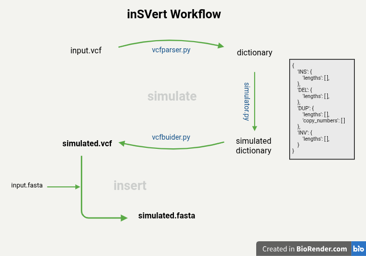

# demo specififcations 


### command-line interface design
```
inSVert <command> [options]

Commands:
    simulate    -analyze input VCF and produce a realistic fake
    insert      -inserts the SVs into the reference genome
    pipeline    -combines the above in a single process
```




## simulate

### vcfparser.py

dependancies: 
- pysam

input: path_to_vcf

output: dictionary

parses a vcf file and stores the relevant information for the simulation in a dictionary data structure

### simulator.py

dependancies:
- vcfparser.py
- scipy (stats)

input: dictionary

output: simulated_dictionary

starting from a dictionary containing information of SVs in a vcf file, simulator.py fits the data from each SV (such as lentghs and copy-number) to a lognormal distribution. Then it samples a *n* number of items from such distribution, such as to match the items in the original dictionary. 
It then structures the data in a similar dictionary such as the one given as input, producing a specular structure with simulated data. 

### vcfparser.py

## insert


------
------

### practical considerations

due to limited computing power, the organism of choice will be yeast.

1. create a new vcf file: 
for this purpose I used Saccharomyces [kudriavzevii](https://trace.ncbi.nlm.nih.gov/Traces/?view=run_browser&page_size=10&acc=SRR7517606&display=download) ONT reads mapped to [Saccharomyces cervisiae](https://www.ncbi.nlm.nih.gov/datasets/genome/GCF_000146045.2/) reference genome, in this fashion i am sure to find a rich profile of structural variants when producing a VCF.

    mapping is done using [minimap2](https://github.com/lh3/minimap2), which is particularly suited for mapping long reads. A preliminary variant calling on the resulting bam file is performed with [sniffles](https://github.com/fritzsedlazeck/Sniffles) 

2. 


---

# TO DO
- check how to handle coordinates when building a VFC also thinking about the later step of FASTA modification


for the final version:

- try to use as few dependancies as possible
- add option to avoid placing SVs near chrom ends (buffer by 1kb) def=FALSE
- add option to simulate SNPs (fix loc parameter of lognormal to 0) (this will inevitably reduce the amount of large SVs) 


