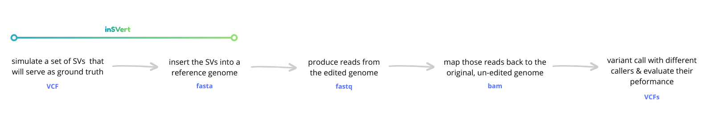

<p align="center">
  
</p>

# inSVert 
inSVert is a toolkit for the simulation of structural variants and for the insertion of structural variants into a reference genome. 

inSVert main utility lies in benchmarking different read mappers and variant callers against a ground thruth set of structural variants. The software is composed by two modules: simulate & insert. 



### inSVert simulate
The first module simulates a custom set of structural variants such as Deletions, Insertions, Inversions, Tandem Duplications and Traslocations according to the user instructions provided in the config.yaml file. The user can choose to simulate variants according to a pareto distribution, which more closely reflects the natural distribution of variants (with fewer long variants and more short variants), or a normal distribution.  
inSVert also takes into account polyploid organisms: the user uses the 'ploidy' and 'heterozygousity' parameters to instruct the simulate module about how many genome copies he intends to simulate the variants on (most likely this corresponds to the ploidy number of the organism of interest) and how likely it is to find a variant on a given copy, thus manipulating the probability of variants of being heterozygus (present only on one copy) or homozygous (present on multiple copies). 

to simulate structural variants, simply type 
```
inSVert simulate config.yaml reference.fasta -o simulated.vcf
```
where the first argument is the path to the config.yaml file and the second one the path to your reference genome in fasta format, you can specify in which file you want your simulated SVs after the -o option. Additionally, you can use the optional --seed argument and set a seed if you need a simulation to be reproducible ex: --seed 123. 


### inSVert insert
given a VCF file , either produced by *inSVert simulate* or provided by the user, the Structural Variants contained in the file will be programmatically inserted into a specified reference genome in fasta format. Although it may seem trivial, this is by far the most complex step as it requires careful tracking of the inserted variants to avoid indexing problems and to avoid placing variants one on top of the other. 

For this reason it is a strict requirement that the VCF file is produced from the same reference in which we are trying to insert the variants and that the VCF file is sorted. Therefore, inSVert will take care of sorting the VCF file if it is not sorted already. 

As far as the reference consistency: it can be easily checked by inspecting the first few lines of the VCF
simply type 
```
head myfile.vcf 
```
and check for a correspondance between the reference of the VCF and the one you want to put the variants in. [to implement] Using a different reference invalidates the whole simulation, therefore inSVert will generate an error if it finds that you are trying to use a reference with a different name from the one from which the VCF has originated. 

to insert Structural Variants from a sorted VCF to a reference genome, simply type 
```
inSVert insert reference.fasta simulated.vcf --ploidy 2 --gc 0.41 -o simulated.fasta
```
where the first argument is the path to the reference genome and the second one the path to the VCF chosen by the user; the --ploidy argument is not optional and requires to specify how many copies of the genome to simulate. If you are using inSVert simulate to produce a VCF, it has to match the ploidy argument of the config.yaml. In any case, the genotype string of your variants in the VCF should be informative about the ploidy number you need to insert here.  
The optional argument --gc allows the user to specify the GC ratio used when generating insertion sequences, in order to make DNA sequences more realistic. The default is set to the human genome GC content (0.41). 


---

# TO DO


for the final version:

- add the option in the simulate.py module to accept a .bed file with some genomic coordinates to exclude from the simulation.
- implement inverted duplication
- multithreading for multiple haplotypes. 
- add an optional parameter to the simulation to replace 'Sample' in 'Sample#Hap#Contig' with a custom name x
- add a generateconfigfile function in the cli.py that generates a template configfile (do it at the end) x
- To maintain a lightweight VCF and independent modules , keep using symbolic <INS> tags , but add an option to the insert command to dynamically generate and save the actual insertion sequences into a separate auxiliary FASTA file for accurate benchmarking. xx


super optional (based on performance on larger genomes)
- Replace the current in-memory sorting  with a pure-Python external merge sort that splits the VCF into small, locally sorted temporary files and streams them back together to prevent memory crashes on large genomes without relying on outside tools

- containerize in docker image 
- write a nextflow benchmarking pipeline 
- when writing the pipeline, perform multiple simulations with different seeds to be able to build a precision-recall curve


