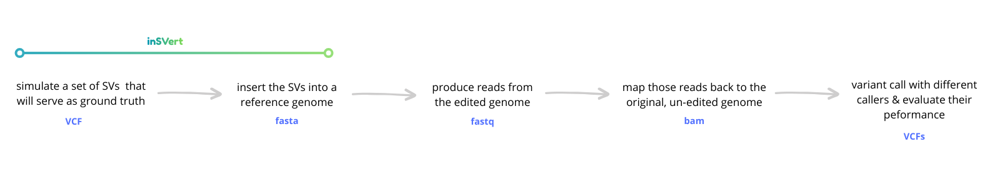

<p align="center">
  
</p>

# inSVert 
inSVert is a software built for the simulation of structural variants and for the insertion of structural variants into a reference genome. 

The software is composed by two modules: simulate & insert. 



# Installation
when installing inSVert, using a virtual enviroment is highly recommended

ensure your packaging tools are updated:
```bash
python3 -m pip install --upgrade pip setuptools wheel
```
install inSVert with:
```bash
git clone https://github.com/thom-99/inSVert
cd inSVert
pip install .
```
# Usage

## inSVert simulate
The first module simulates a custom set of variants according to the user instructions provided in the config.yaml file.
You can use the configfile.yaml available in this repo or generate a template one with 

```
inSVert generate-configfile
```
then edit it based on what you want to simulate

The user can choose to simulate variants according to a pareto distribution, which more closely reflects the natural distribution of variants (with fewer long variants and more short variants), or a normal distribution.  

inSVert also takes into account polyploid organisms: the user uses the 'ploidy' and 'heterozygousity' parameters to instruct the simulate module about how many genome copies he intends to simulate the variants on (most likely this corresponds to the ploidy number of the organism of interest) and the probability of variants of being heterozygous (present only on one genome copy). 

to simulate variants, simply type 
```
inSVert simulate config.yaml reference.fasta -o simulated.vcf
```
where the first argument is the path to the config.yaml file and the second one the path to your reference genome in fasta format.

optional arguments:
```
-o, --output PATH
    Path for the output VCF file. Default: simulated.vcf.

--seed INTEGER
    Random seed for reproducible simulations.

--exclude PATH
    BED file containing genomic regions to exclude from simulation, such as
    centromeres or mitochondrial DNA.

--non-symbolic
     Write explicit REF and ALT sequences instead of symbolic alleles such as
    <INS> and <DEL>. This can substantially increase the output VCF size
```

## inSVert insert
given a VCF file , either produced by *inSVert simulate* or provided by the user, the  variants contained in the file will be programmatically inserted into a specified reference genome in fasta format. Although it may seem trivial, this is by far the most complex step as it requires careful tracking of the inserted variants to avoid indexing problems and to avoid placing variants one on top of the other. 

For this reason it is a strict requirement that the VCF file is produced from the same reference in which we are trying to insert the variants and that the VCF file is sorted. Therefore, inSVert check both requiremenrs and take care of sorting the VCF file if not already sorted.


to insert variants from a sorted VCF to a reference genome, simply type 
```
inSVert insert reference.fasta simulated.vcf --ploidy 2 -o simulated.fasta
```
where the first argument is the path to the reference genome and the second one the path to the VCF chosen by the user; the --ploidy argument is not optional and requires to specify how many copies of the genome to simulate. If you are using inSVert simulate to produce a VCF, it has to match the ploidy argument of the config.yaml. In any case, the genotype string of your variants in the VCF should be informative about the ploidy number you need to insert here.  

optional arguments:

```
-o, --output PATH
    Path for the output FASTA file.

--truth-vcf PATH
    Write a ground-truth VCF containing only variants successfully inserted
    into the output FASTA. Recommended for third-party VCFs, where malformed,
    unsupported, or conflicting records may be skipped.

--gc FLOAT
    GC fraction used when generating insertion sequences. Must be between
    0 and 1. Default: 0.41.

--sample-name TEXT
    Sample name used in multi-haplotype FASTA headers. Default: Sample.

--skip-unphased-variants
    Skip unphased variants instead of assigning them randomly to a haplotype.

--split-haplotypes
    Write each haplotype to a separate FASTA file. For example, an output
    named output.fa with ploidy 2 produces output_hap1.fa and output_hap2
```


# Architecture 


inSVert has a decoupled architecture, designed so that its modules can be used as a standalone bioinformatic utility. 


# TO DO

**main features**

**bugs**

**quality of life**

- implement optional argument in the simulate command to include only specific regions using a bed file (--include-only)


**performance optimizations**
- multiprocessing for multiple haplotypes as a DEFAULT (speed)(keep for v1)

**extras**
- containerize in docker image 
- write a nextflow benchmarking pipeline 
- when writing the pipeline, perform multiple simulations with different seeds to be able to build a precision-recall curve

utilities:
- web app that takes a user inputted SV in a simple to understand format like a .bed format and transforms it into a VCF record. It should be able to work with something like a tsv or bed format and be able to process multiple lines. 


