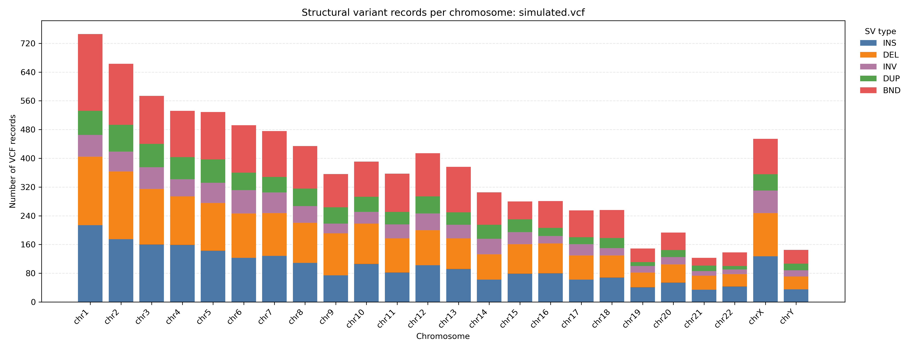
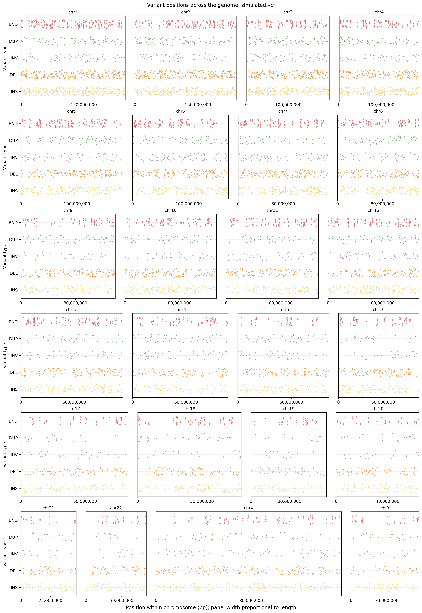

# Getting started 

contents:
1. [download](#download)
2. [variant simulation](#variant-simulation)
3. [variant insertion](#variant-insertion)

### download
download inSVert, using a virtual enviroment is highly recommended
```bash
python -m pip install --upgrade pip setuptools wheel

git clone https://github.com/thom-99/inSVert
cd inSVert
python -m pip install .
```

for this tutorial we use the human GRCh38/hg38 reference, you can use your genome of interest instead
```bash
wget -c https://hgdownload.soe.ucsc.edu/goldenPath/hg38/bigZips/latest/hg38.fa.gz
gunzip hg38.fa.gz
```

### variant simulation
for this tutorial we use the config.yaml file below, you can edit it to your likings

```
genome:
  ploidy: 2
  heterozygosity: 0.6

variants:
  # Single-nucleotide polymorphisms
  SNP:
    count: 1000000
    tstv_ratio: 2.0

  # Multi-nucleotide polymorphisms
  MNP:
    count: 50000
    tstv_ratio: 2.0

  # Deletions
  DEL:
    count: 2500
    distribution: pareto
    parameters:
      median_length: 1000
      min_length: 50
      max_length: 100000

  # Insertions
  INS:
    count: 2500
    distribution: pareto
    parameters:
      median_length: 1000
      min_length: 50
      max_length: 100000

  # Tandem duplications
  DUP:
    count: 1000
    distribution: normal
    parameters:
      median_length: 3000
      sigma: 500
      min_length: 100
      max_length: 20000
    copy_number:
      min: 2
      max: 5
      weights: [0.7, 0.2, 0.07, 0.03]

  # Inversions
  INV:
    count: 1000
    distribution: pareto
    parameters:
      median_length: 10000
      min_length: 1000
      max_length: 500000

  # Interspersed duplications / copy-and-paste translocations
  TRA_COPY:
    count: 250
    distribution: normal
    reverse_ratio: 0.2
    parameters:
      median_length: 20000
      sigma: 2000
      min_length: 1000
      max_length: 200000

  # Cut-and-paste translocations
  TRA_CUT:
    count: 250
    distribution: normal
    reverse_ratio: 0.2
    parameters:
      median_length: 20000
      sigma: 2000
      min_length: 1000
      max_length: 200000
```

we simulate our collection of variants using a seed for reproducibility and we store the output in a file called simulated.vcf
```bash
inSVert simulate config.yaml hg38.fa --seed 1234 -o simulated.vcf
```

optionally, we can visualize and get an idea of our simulated variants with some useful scripts. I provide two under the [scripts/](https://github.com/thom-99/inSVert/tree/main/scripts) folder in inSVert's github page.
```bash
# install matplotlib if not already present
pip install matplotlib

# visualize the amount of structural variants on each chrom (exclude small contigs)
python histoplot.py simulated.vcf -o sv-counts-by-chromosome.png --min-contig-fraction 0.005
# visualize the variants starting positions by chromosome (exclude small contigs)
python posplot.py simulated.vcf -o variant-positions-by-chromosome.png --min-contig-fraction 0.005
```

Stacked bar chart of simulated structural-variant records per chromosome:


Simulated structural-variant startingpositions across chromosomes


### variant insertion

we insert our simulated variants back into out reference **hg38.fa** specifying that we are looking to simulate 2 haplotypes with --ploidy 2 (congruent to out config.yaml)
```bash
inSVert insert hg38.fa simulated.vcf --ploidy 2 -o simulated_genome.fa
```
if you want to insert variants from your own VCF file rather than a VCF produced by inSVert simulate module, you are encouraged to use the optional argument --truth-vcf which writes a copy of your VCF in which only the variants that were correctly inserted into the reference are present
```bash
inSVert insert hg38.fa myown.vcf --ploidy 2 -o simulated_genome.fa --truth-vcf inserted_variants.vcf
```

